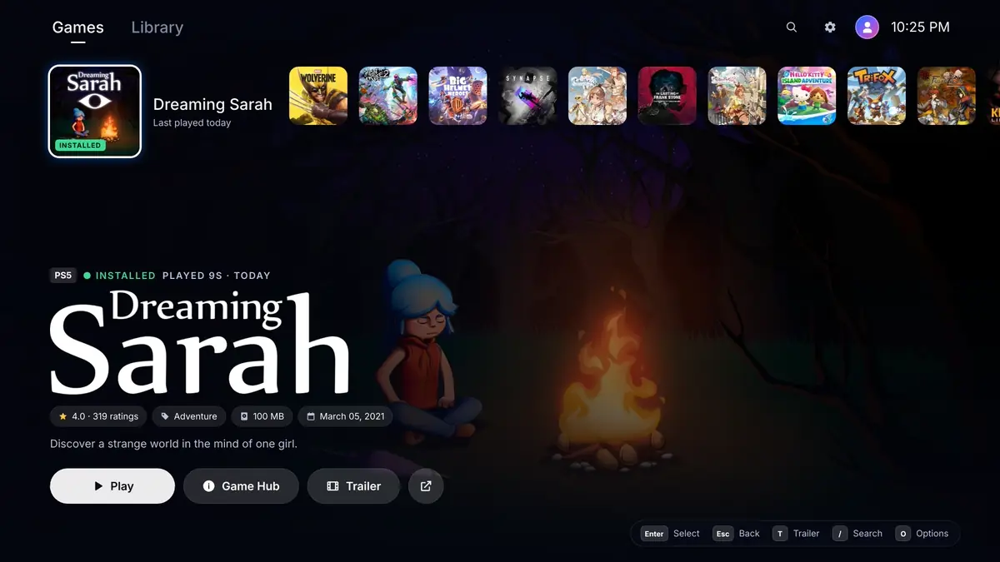

# PS5 Launcher

A PS5-style home screen for Linux. Browse PS5 and PS4 games with their official artwork, download
and install them, and play them with the [KytyPS5](https://github.com/KytyPS5/KytyPS5) (PS5) and
[shadPS4](https://github.com/shadps4-emu/shadPS4) (PS4) emulators, using a controller, keyboard or
mouse.



- **Your games on a PS5-style Home screen**, with official backgrounds, logos and trailers that
  play right in the launcher.
- **A Library of 400+ PS5 games** with search, genre filters and sorting.
- **PS4 games too:** they run on shadPS4, which the launcher installs and updates by itself, like KytyPS5.
- **See what runs:** every game shows how far it gets in its emulator.
- **Download, install and play** without leaving the launcher.
- **Keeps itself and KytyPS5 up to date**, without touching your saves.

## Install

You need 64-bit Linux: Ubuntu 22.04+, Debian 12+, Fedora 36+, Mint 21+, Arch or SteamOS 3.
Open a terminal and run:

```bash
curl -fsSL https://github.com/MohamedAliRashad/ps5-launcher/releases/latest/download/ps5-launcher-linux-x86_64.tar.gz | tar xz && ./ps5-launcher-linux-x86_64/install.sh
```

**PS5 Launcher** is now in your app menu. For trailers, switching between a game and the
launcher, and installing from archives, also run (Ubuntu, Debian, Mint):

```bash
sudo apt install xdotool mpv libarchive13
```

To uninstall: `./ps5-launcher-linux-x86_64/install.sh --uninstall`

## Or turn a spare PC into a console

**PS5 Launcher OS** makes a PC start straight into the launcher, like a console. It's
[Bazzite](https://bazzite.gg), a gaming Linux, with the launcher built in. The launcher, its
emulators and the system all keep themselves up to date.

**You need:**
- A USB stick (2 GB or more) and an internet connection, cable or Wi-Fi.
- A PC that can run the games: a 4-core CPU from 2013 or later (Intel Haswell or AMD Excavator
  and newer), 8 GB RAM (16 GB for PS5 games), a graphics card with Vulkan 1.3 (AMD, NVIDIA or
  Intel) and a 64 GB disk.

**Installing erases the disk you pick.**

1. Download [ps5-launcher-os-x86_64.iso](https://github.com/MohamedAliRashad/ps5-launcher/releases/latest/download/ps5-launcher-os-x86_64.iso)
   and write it to the USB stick with [balenaEtcher](https://etcher.balena.io) or
   [Fedora Media Writer](https://fedoraproject.org/workstation/download).
2. Start the PC from the USB stick (press F12, F11, F8 or Esc while it starts) and choose
   **Install PS5 Launcher OS**.
3. In the installer, choose your language, then on the summary screen:
   - **Network & Host Name:** connect to Wi-Fi if you have no cable.
   - **Installation Destination:** pick the disk and press **Done**. Leave **Encrypt my data**
     off, or the PC asks for a passphrase every time it starts.
   - **Time & Date:** pick your city (the launcher shows the time).
   - **User Creation:** your name and a password.

   Then **Begin Installation**. It downloads the system (about 7 GB), so it takes a while. The
   installer says "Fedora": Bazzite is built on Fedora and uses its installer.
4. Restart and remove the USB stick. If Secure Boot is on, a blue **MOK management** screen
   appears once: choose **Enroll MOK**, **Continue**, **Yes**, type `universalblue`, then
   **Reboot**.

The PC now starts straight into PS5 Launcher, and it picks the NVIDIA version of the system by
itself when it finds an NVIDIA graphics card. To get to the desktop, quit the launcher
(**Settings → Quit**); it opens again at the next start or from the app menu.

## Getting started

1. Open **PS5 Launcher** from your app menu, or run this in a terminal:

   ```bash
   ps5-launcher
   ```

   The first launch downloads artwork and KytyPS5, which takes about a minute.
2. Already have games? Add their folder in **Settings → Game folders**.
3. To get a game, open it in the **Library**, choose **Download**, then **Install**, then
   **Play**. Keep the launcher open while it downloads.

> Only download games you own. Downloads use BitTorrent: other people can see your IP address,
> and finished downloads are shared while the launcher is open (turn this off in
> **Settings → Keep sharing finished downloads**).

## Controls

| Action | Controller | Keyboard |
|---|---|---|
| Move / Select / Back | D-pad, ✕, ○ | Arrows, Enter, Esc |
| Options for a game | Options | O |
| Search | △ | / |
| Switch Home ⇄ Library | L1 / R1 | Tab |
| Switch between game and launcher | PS button | |
| Downloads | | Ctrl+D |

**Games play best with a controller.** DualSense, DualShock 4, Xbox and most other controllers
work in games over USB or Bluetooth with no setup; connect yours before starting a game. Without
one, games use the keyboard: **J I K L** for ✕ △ □ ○, **W A S D** to move, **arrow keys** for the
D-pad and **Enter** for Options (PS4 games use **N C V B** for ✕ △ □ ○). See **Settings → Keyboard
controls in games** for every key.

## Will my game run?

Each game shows a tag from its emulator's community list ([KytyPS5](https://kytyps5.github.io/) for
PS5, [shadPS4](https://github.com/shadps4-compatibility/shadps4-game-compatibility) for PS4):
🟢 **In-game**, 🟡 **Menus**, 🟠 **Boots** (intro logos only), 🔴 **Doesn't boot**, or ⚪ **Untested**.

Linux results come first. A result from Windows is marked **Win**, because games can behave
differently on Linux. In the Library, **In-game** lists every game that reaches gameplay, and
**In-game on Linux** only the ones confirmed on Linux.

**Help others:** when you close a game, the launcher asks how far it got, and your answer
becomes its tag on your PC. Every so often, choose **Settings → Share your game ratings** to send
your results to the community lists (needs a free GitHub account).

PS4 releases shipped as **PKG packages** install like any other: the launcher unpacks the game,
its update and its DLC for shadPS4 (it fetches a small PKG extractor the first time, and needs
Linux 5.13 or newer). PS5 PKG
releases can't be installed; pick a release that is a folder, an archive or an exFAT image.

## Help

- **A game closes right away:** check its tag, then **Options → View emulator log**.
- **Resume or Stop doesn't work:** install `xdotool`.
- **Wrong screen:** change **Settings → Display**. For a window, run `ps5-launcher --windowed`.
- **Too big or too small:** run `PS5_LAUNCHER_SCALE=1.15 ps5-launcher` (bigger number, bigger UI).
- **A new KytyPS5 broke a game:** **Settings → Roll back to previous KytyPS5**.

Still stuck? [Open an issue](https://github.com/MohamedAliRashad/ps5-launcher/issues).
Developers: see the [developer guide](docs/DEVELOPMENT.md).

---

PS5 Launcher is an unofficial fan project, not affiliated with or endorsed by Sony Interactive
Entertainment. "PlayStation" and "PS5" are trademarks of Sony Interactive Entertainment. Game
artwork and information belong to their owners. Use only games you own.

<a href="https://slint.dev"></a>
