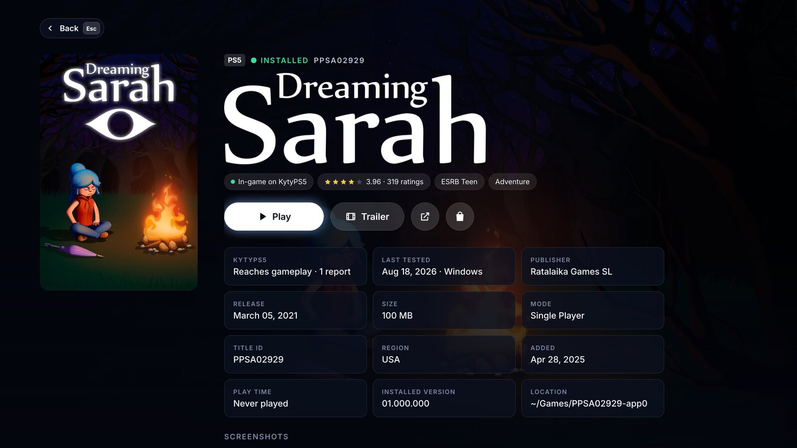
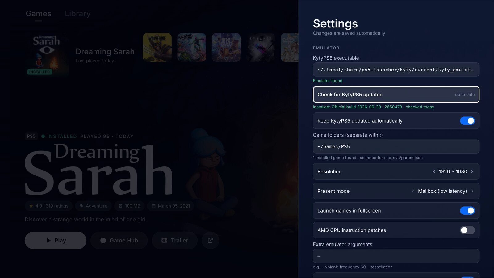

# PS5 Launcher

A fast, native PS5-style game launcher for Linux. It browses the PS5 games catalog with the
official PlayStation artwork, and launches your installed games with the
[KytyPS5](https://github.com/KytyPS5/KytyPS5) emulator.

It's a single native binary written in Rust with a GPU-accelerated [Slint](https://slint.dev)
UI, and it doesn't use a browser or Electron. It starts in a fraction of a second and uses no
CPU when idle.


## Install

### Quick install (recommended)

Run this in a terminal:

```bash
curl -fsSL https://github.com/MohamedAliRashad/ps5-launcher/releases/latest/download/ps5-launcher-linux-x86_64.tar.gz | tar xz && ./ps5-launcher-linux-x86_64/install.sh
```

This downloads the latest release. It installs the launcher to `~/.local/bin` and adds
**PS5 Launcher** to your app menu. You don't need `sudo`, Rust or a compiler.

The prebuilt binary runs on 64-bit Linux with glibc 2.35 or newer. That covers Ubuntu 22.04+,
Debian 12+, Fedora 36+, Linux Mint 21+, Pop!_OS 22.04+, Arch and SteamOS 3. You can also
download the archive yourself from the
[Releases page](https://github.com/MohamedAliRashad/ps5-launcher/releases) and run
`./install.sh` inside it.

To remove it, run `./install.sh --uninstall`. To start it when you log in, install with
`./install.sh --autostart`.

**Updates are automatic.** The launcher checks GitHub for a new release when it starts and
every 6 hours. It downloads it in the background, checks it against GitHub's SHA-256
checksum, makes sure it runs, and swaps it in. The new version starts the next time you open
the launcher, or right away with **Settings → Restart now** (never while a game is running).
The previous binary is kept as `ps5-launcher.previous` next to it. To turn this off, disable
**Settings → Keep PS5 Launcher updated automatically**.

> Installed v1.2.0 or older? Run the install command above once more to get the auto-updater.

### Build from source

```bash
git clone https://github.com/MohamedAliRashad/ps5-launcher.git
cd ps5-launcher
./install.sh
```

When run in a source checkout, the script:

1. checks for Rust and offers to install it with [rustup](https://rustup.rs) (no `sudo`) if it's missing;
2. builds an optimized release binary;
3. installs it to `~/.local/bin/ps5-launcher` and adds **PS5 Launcher** to your app menu.

A source build installed this way updates itself like a release build. A binary run straight
from `target/release/` only tells you about new releases; update it with `git pull` and
`./install.sh`.

| Command | What it does |
|---|---|
| `./install.sh --autostart` | Also start the launcher when you log in (console-style) |
| `./install.sh --uninstall` | Remove the launcher (keeps your settings and cache) |
| `PREFIX=/usr/local sudo -E ./install.sh` | Install for all users |

### If the build fails

It's almost always a missing build package. Install the one for your distro and run
`./install.sh` again:

| Distro | Command |
|---|---|
| Ubuntu / Debian / Mint / Pop!_OS | `sudo apt install build-essential pkg-config libfontconfig1-dev libxkbcommon-dev` |
| Fedora | `sudo dnf install gcc pkgconf-pkg-config fontconfig-devel libxkbcommon-devel` |
| Arch / Manjaro / SteamOS | `sudo pacman -S --needed base-devel fontconfig libxkbcommon` |
| openSUSE | `sudo zypper install gcc pkg-config fontconfig-devel libxkbcommon-devel` |

The launcher needs Rust 1.88 or newer. If yours is older, update it with `rustup update stable`.

### Optional helpers

The launcher works without these, but each one turns on a feature:

| Tool | Enables |
|---|---|
| `xdotool` | **Resume** / **Stop** that switch to and close the game window, plus the PS button toggle between game and launcher (X11) |
| `mpv` | Fullscreen trailers inside the launcher. Without it, trailers open in your browser |
| `yt-dlp` | YouTube trailers in `mpv` |
| `xrandr` | Picking the display and scaling the UI to fit it |

On Ubuntu and Debian: `sudo apt install xdotool mpv yt-dlp x11-xserver-utils`

## Launch

- From your app menu, open **PS5 Launcher**.
- From a terminal, run `ps5-launcher`.

| Flag | Effect |
|---|---|
| `--windowed` | Open in a window instead of fullscreen |
| `--monitor DP-2` | Use a specific display (names come from `xrandr --listmonitors`) |
| `--sync` | Re-download the game catalog on start |
| `--help`, `--version` | Show help or the version |

**First launch:** a welcome screen gets everything ready before you're let in. With one
progress bar it:

1. downloads the catalog (about 1 second);
2. downloads the official artwork (about a minute for all 700+ games);
3. downloads the **latest KytyPS5 build**;
4. downloads every Library cover, and the backgrounds, logos and icons of every game on the Home
   screen;
5. preloads the Home screen and the first page of the Library.

On a typical connection this takes about a minute. After that, the Game Hub art for every
other game downloads in the background, newest first. It takes about 3–4 minutes, with a small
progress line at the bottom of the screen. Sony's image server takes about a second per image,
so after this every Game Hub opens instantly instead of loading. The image cache ends up at
about 500 MB in `~/.cache/ps5-launcher/`.

Then it asks you to press **✕ / Enter** to start. You can skip the wait; anything left keeps
downloading in the background.

**Later launches:** a short splash shows while the Home screen loads from the local cache,
which takes well under a second. Covers for newly added games download quietly in the
background.

**Add your games:** point **Settings → Game folders** at the folder that holds your games. A
game is any folder with a `sce_sys/param.json`.

## KytyPS5 updates

The launcher installs and updates [KytyPS5](https://github.com/KytyPS5/KytyPS5) for you, using
its official Linux builds from GitHub Releases.

- **Automatic:** it checks for a new build at startup and every 6 hours, and installs it in the
  background. A small progress line shows at the bottom, and a notification appears when it's
  done.
- **Never mid-game:** if a game is running, the update waits until you close it.
- **Verified:** every download is checked against GitHub's SHA-256 checksum. The new build must
  start before the launcher switches to it.
- **Your saves are safe:** Kyty's saves, shader caches and patches (`_SaveData`,
  `_PipelineCache`, …) live in one shared folder that every version uses. Updates never touch them.
- **Rollback:** the previous build is kept. **Settings → Roll back to previous KytyPS5** switches
  back to it, and that build won't be reinstalled automatically.
- **Using your own build:** if you set **Settings → KytyPS5 executable** to a build you compiled,
  the launcher tells you when a newer official build exists but leaves yours alone.
  **Switch to official KytyPS5 builds** moves you to auto-updates and *copies* your saves across;
  your own build folder isn't changed.

To turn this off, disable **Settings → Keep KytyPS5 updated automatically**. Managed builds live
in `~/.local/share/ps5-launcher/kyty/`.

## Controls

| Action | Controller | Keyboard | Mouse |
|---|---|---|---|
| Move | D-pad / left stick | Arrow keys | Scroll wheel over the tiles |
| Select / Play | ✕ | Enter | Click |
| Back | ○ | Esc / Backspace | Click outside a panel |
| Trailer | □ | T | |
| Search | △ | / (or just start typing in the Library) | Click the search box |
| Options menu | Options | O | |
| Switch Games ⇄ Library | L1 / R1 | Tab | Click the tab |
| Page through the Library | L2 / R2 | Page Up / Page Down, Home / End | |
| Switch between game and launcher | PS button | | |
| Quit | | Ctrl+Q | |

The launcher reads controllers directly, so the PS button works even while a game is
fullscreen. This needs your user to have access to `/dev/input`. Most distros give the logged-in
user that access; if yours doesn't, add yourself to the `input` group.

## Features

- **PS5 Home screen:** a tile row where the selected tile grows and shows its name, the game's
  hub art as a full-screen background, and its official title logo.
- **Official artwork and details:** for about 96% of games, looked up by title ID in Sony's
  public PlayStation catalog. That includes tile icons, clean covers, backgrounds, logos,
  screenshots, trailers, star ratings, age ratings and publishers.
- **RAWG (optional):** add a RAWG API key in Settings to fill in the rest by name. The key is
  checked before it's saved and is never displayed again.
- **Library:** the whole catalog with instant search, genre filters, and sorting by date, name,
  release, rating or size.
- **Game Hub:** a details page for each game, with a fact grid, a screenshot viewer and an
  About section.
- **Steam-style sessions:**
  - a running game shows a **Playing** badge, a live timer, and **Resume** / **Stop**;
  - **Stop** closes the game cleanly, like Alt+F4, so Kyty keeps its shader cache;
  - it tracks playtime and "last played";
  - games you start from Kyty's own launcher or a terminal are detected too;
  - a crash shows the end of the emulator log.
- **Options menu:** open the game folder, view the emulator log, open the web or Store page,
  or watch the trailer.
- **Multi-monitor:** the launcher opens on one display and never spans two. Choose which one in
  Settings.
- **KytyPS5 compatibility tags:** every game shows how far it gets in KytyPS5, from the
  community [compatibility list](https://kytyps5.github.io/) (the same data KytyPS5's own
  launcher uses, refreshed every 6 hours):

  | Tag | Meaning |
  |---|---|
  | 🟢 **In-game** | Reaches gameplay |
  | 🟡 **Menus** | Reaches the main menu, not gameplay |
  | 🟠 **Boots** | Shows the intro logos, then stops |
  | 🔴 **Doesn't boot** | Doesn't start |
  | ⚪ **Untested** | No reports yet |

  Tags appear on Library covers, on the Home screen and in the Game Hub (with the number of
  reports, when it was last tested and, if different, the result on Linux). In the Library,
  **In-game on KytyPS5** filters to games that reach gameplay, and the **KytyPS5 compatibility**
  sort puts the best-supported games first.
- **KytyPS5 auto-updates:** installs the official build on first launch, then keeps it current,
  with rollback.
- **Launcher auto-updates:** new PS5 Launcher releases install themselves in the background and
  start on the next launch (or with **Restart now**).

| Game Hub | Settings |
|---|---|
|  |  |

## Where things are stored

| Path | Contents |
|---|---|
| `~/.config/ps5-launcher/config.json` | Settings |
| `~/.config/ps5-launcher/playtime.json` | Playtime per game |
| `~/.cache/ps5-launcher/` | Catalog, artwork, decoded thumbnails, emulator logs (safe to delete) |
| `~/.local/share/ps5-launcher/kyty/` | Managed KytyPS5 builds and their shared saves and caches (`data/`) |

## Performance

- **Rendering:** the UI is drawn by the GPU through OpenGL. When nothing on screen moves, the
  launcher uses no CPU or GPU.
- **Images:**
  - they're decoded and resized on background threads;
  - resized copies are cached as QOI files, which load about 10× faster than PNG, so a warm
    start never decodes a JPEG or touches the network;
  - memory for images is capped at 200 MB, and the least recently shown are dropped first.
- **Library grid:** only the rows on screen exist as UI elements, so browsing 740 games is as
  smooth as browsing 10.
- **Moving along the tile row:** the neighbouring games' backgrounds and logos load ahead of
  time, so they're ready when you get there.

## Troubleshooting

- **The window is on the wrong screen:** change **Settings → Display**, or start once with
  `--monitor NAME`.
- **Resume or Stop does nothing:** install `xdotool`. On Wayland, Stop falls back to asking
  the emulator to quit.
- **A game exits right away:** open **Options → View emulator log**. Most boot problems come
  from Kyty itself; see its [compatibility list](https://kytyps5.github.io/).
- **The UI is too big or too small:** it scales itself to the window, on any screen size or
  shape. To make everything larger or smaller, set a multiplier, for example
  `PS5_LAUNCHER_SCALE=1.15 ps5-launcher`.
- **Images feel slow:** run `PS5_LAUNCHER_DEBUG=1 ps5-launcher` from a terminal. Every image
  load is logged with where it came from (disk or network) and how long each step took.
- **Reset everything:** `rm -rf ~/.config/ps5-launcher ~/.cache/ps5-launcher`

## Building by hand

```bash
cargo build --release            # binary: target/release/ps5-launcher
cargo test --release             # unit tests
```

To check every screen at 8 screen sizes (720p to 4K, 16:10 and ultrawide) under a real window
manager (needs Xvfb, xfwm4, xdotool and ImageMagick):

```bash
scripts/ui_matrix.py                    # writes dist/ui-matrix/sheet-<size>.png
```

To regenerate the README demo after UI changes (needs Xvfb, xdotool, ffmpeg and ImageMagick):

```bash
scripts/record_demo.py --game /path/to/an/installed/game   # writes dist/demo/
```

It runs the real launcher on a hidden virtual display with a throwaway home folder, drives it
with key presses and captions each step, so nothing personal appears in the recording.

## Disclaimer

PS5 Launcher is an unofficial fan project. It isn't affiliated with or endorsed by Sony
Interactive Entertainment. "PlayStation" and "PS5" are trademarks of Sony Interactive
Entertainment. Game artwork and metadata belong to their owners and are loaded from public
services at runtime. This project doesn't host, distribute or download games. Use only games
you own.
